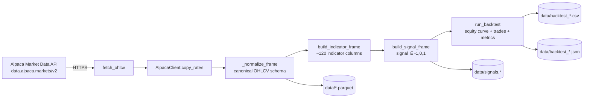
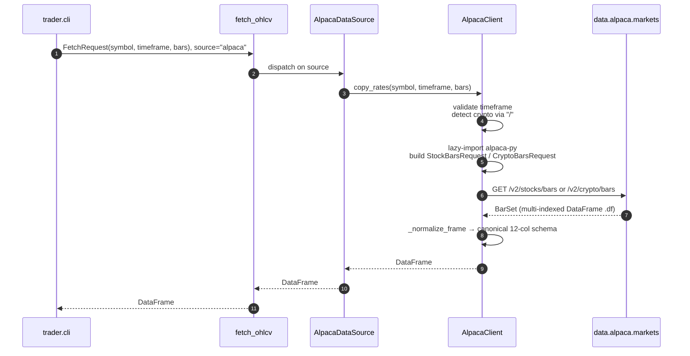
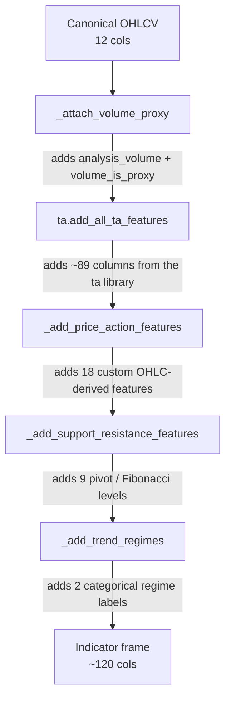
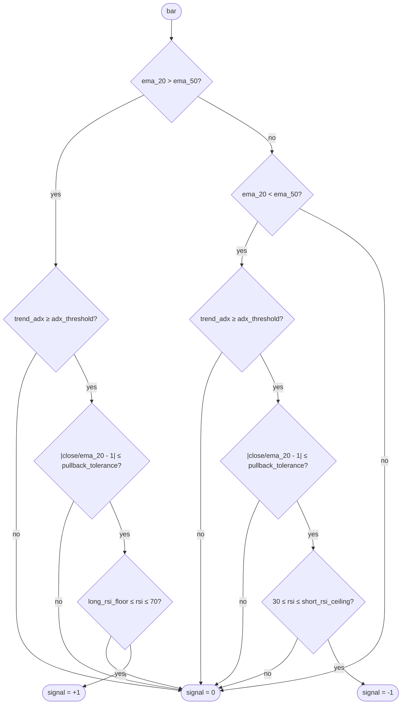
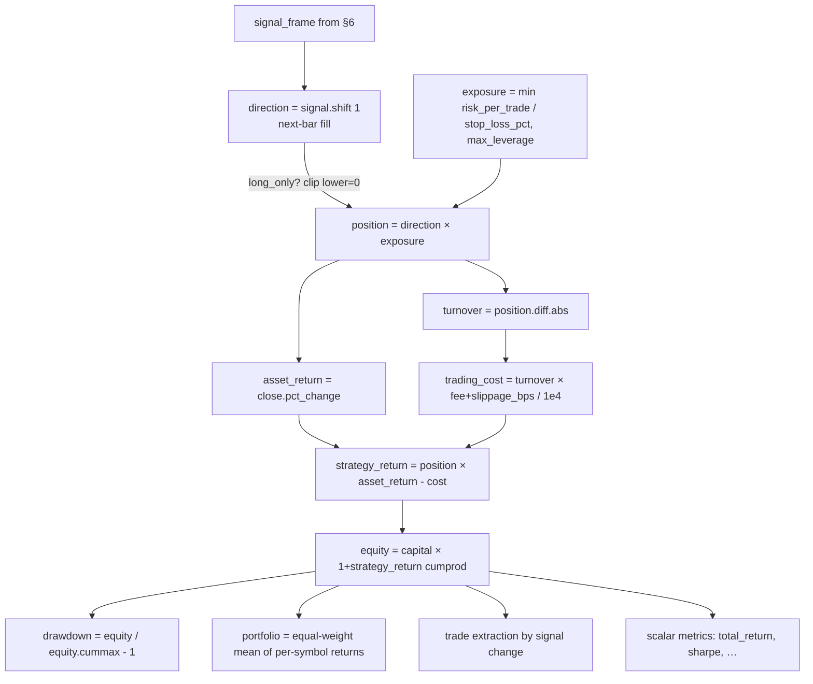
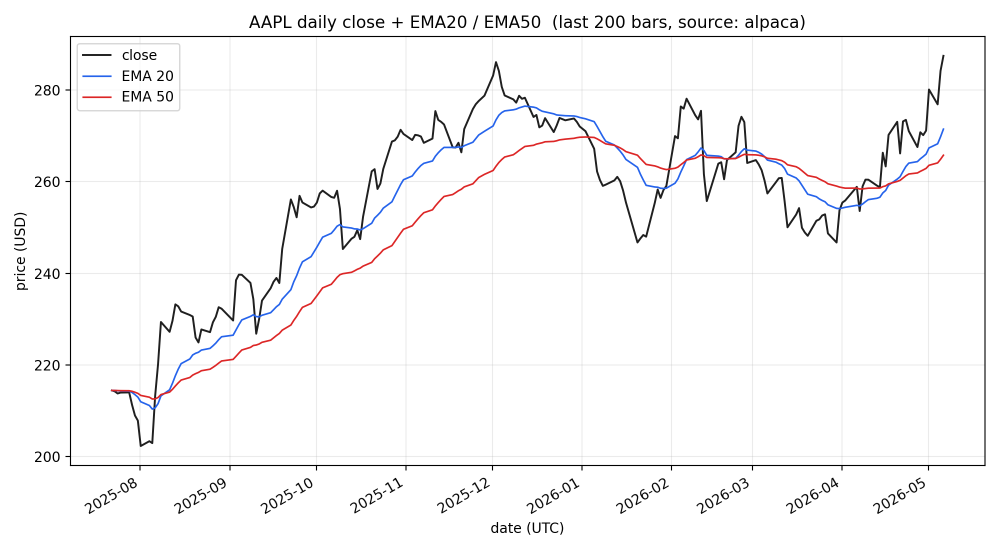
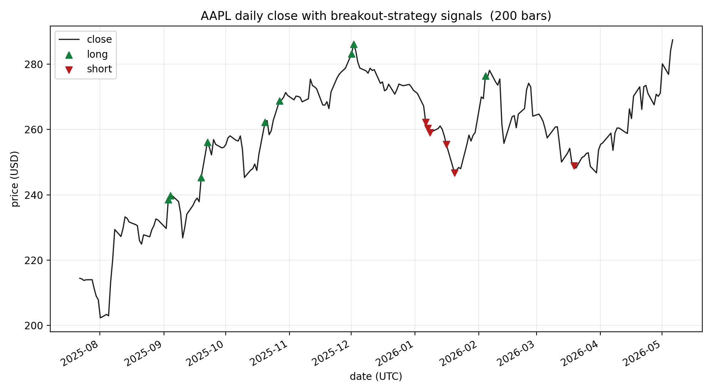
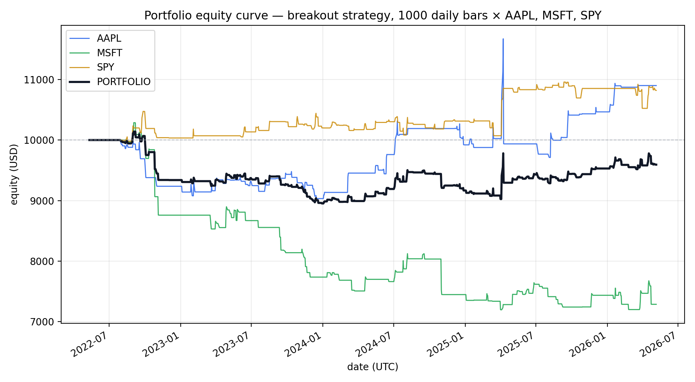

# Data Flow

This document traces every piece of data that the `trader` workbench produces — where it originates, how it is transformed, and where it lands. The active and only data path is **Alpaca**.

> The repo previously also wrapped MetaTrader 5 and Yahoo Finance; those paths were removed. See `git log` for the historical implementation.

---

## 1. Overview



Five distinct stages: **fetch → normalize → enrich → decide → simulate**. Each stage has a single responsibility and a stable schema; downstream stages only consume what their predecessor advertises.

---

## 2. Source — Alpaca Market Data

The repo hits **only** the historical-data domain. Trading endpoints are not used in this pass.

| Client (alpaca-py) | URL | Used for |
|---|---|---|
| `StockHistoricalDataClient` | `https://data.alpaca.markets/v2/stocks/bars` | Equities, ETFs (e.g. `AAPL`, `SPY`) |
| `CryptoHistoricalDataClient` | `https://data.alpaca.markets/v2/crypto/bars` | Crypto pairs (e.g. `BTC/USD`) |
| `TradingClient(paper=True)` | `https://paper-api.alpaca.markets/v2` | **not used** (no `TradingClient` instance) |
| `TradingClient(paper=False)` | `https://api.alpaca.markets/v2` | **not used** |

Authentication is a single key pair shared by both data and trading endpoints; the `Paper Trading` toggle in the Alpaca dashboard generates keys that work for either.

| Env var | Default | Purpose |
|---|---|---|
| `ALPACA_API_KEY_ID` | (required) | Alpaca API Key ID; starts with `PK` for paper accounts |
| `ALPACA_API_SECRET_KEY` | (required) | Alpaca API Secret |
| `ALPACA_PAPER` | `true` | Currently a no-op — would matter once a `TradingClient` is added |
| `ALPACA_DATA_FEED` | `iex` | `iex` is free; `sip` requires the paid Algo Trader Plus tier |

Symbol routing happens inside `AlpacaClient`: a `/` in the symbol routes to the crypto client, otherwise to the stock client. This is why the canonical separator for crypto is `BTC/USD` rather than `BTCUSD`.



Free-tier rate limit: 200 requests/min. The CLI fetches one symbol per request, so a 10-symbol dataset run costs 10 requests.

---

## 3. Raw response from Alpaca

Each bar in the API response carries the following fields. The repo keeps only OHLCV; `vwap` and `trade_count` are dropped during normalization.

| Alpaca field | Type | Kept? | Notes |
|---|---|---|---|
| `timestamp` | UTC datetime | ✓ → `time` | Index level; UTC tz-aware |
| `open` | float | ✓ | |
| `high` | float | ✓ | |
| `low` | float | ✓ | |
| `close` | float | ✓ | |
| `volume` | int | ✓ | Real exchange volume (real for stocks, real for crypto) |
| `vwap` | float | ✗ | Not propagated |
| `trade_count` | int | ✗ | Not propagated |

For crypto (`BTC/USD` etc.), Alpaca returns the same shape; `volume` is base-asset volume.

---

## 4. Canonical OHLCV schema

`_normalize_frame` (`src/trader/alpaca.py`) emits a fixed 12-column DataFrame. This schema is the contract every downstream stage relies on. The three NA columns are kept so that any future broker-quote integration (or downstream consumer expecting them) can stay schema-compatible.

| Column | Type | Source | Notes |
|---|---|---|---|
| `time` | `datetime64[ns, UTC]` | Alpaca `timestamp` | Always UTC. Sorted ascending. |
| `open` | float | Alpaca | |
| `high` | float | Alpaca | |
| `low` | float | Alpaca | |
| `close` | float | Alpaca | |
| `volume` | float | Alpaca | Trade volume |
| `tick_volume` | `pd.NA` | — | Reserved; not provided by Alpaca |
| `spread` | `pd.NA` | — | Reserved; not provided by Alpaca |
| `real_volume` | `pd.NA` | — | Reserved; not provided by Alpaca |
| `symbol` | str | request | Verbatim — `AAPL`, `BTC/USD`, etc. |
| `timeframe` | str | request | One of `5m`, `15m`, `1h`, `4h`, `1d` |
| `data_source` | str | constant | `"alpaca"` |

The `bars` parameter is enforced last — the frame is sorted by `time`, then `.tail(bars)` truncates so the **most recent** N bars are kept.

---

## 5. Indicator pipeline

`build_indicator_frame` (`src/trader/indicators.py`) takes the canonical OHLCV frame and adds ~120 derived columns, in this order:



### 5.1 Volume

For Alpaca stocks `volume` is real, so `analysis_volume = volume` and `volume_is_proxy = False`. The proxy fires only when neither real nor tick volume is available — currently no live data path produces that, but the branch is kept for downstream callers that may feed in volumeless OHLCV.

| Column | Description |
|---|---|
| `analysis_volume` | Working volume series fed into `ta.add_all_ta_features`. Real volume when present, otherwise `(range_pct + |return|) × 1e6`. |
| `volume_is_proxy` | Boolean. `True` when the proxy fired. |
| `volume_adi` | Accumulation / Distribution Index |
| `volume_obv` | On-Balance Volume |
| `volume_cmf` | Chaikin Money Flow |
| `volume_fi` | Force Index |
| `volume_em` | Ease of Movement |
| `volume_sma_em` | SMA(Ease of Movement) |
| `volume_vpt` | Volume Price Trend |
| `volume_vwap` | Volume-Weighted Average Price |
| `volume_mfi` | Money Flow Index |
| `volume_nvi` | Negative Volume Index |

### 5.2 Volatility

| Column | Description |
|---|---|
| `volatility_bbm` / `_bbh` / `_bbl` | Bollinger Bands middle / upper / lower |
| `volatility_bbw` / `_bbp` | Bollinger width and %b |
| `volatility_bbhi` / `_bbli` | Bollinger high / low band crossover indicators |
| `volatility_kcc` / `_kch` / `_kcl` | Keltner Channel middle / upper / lower |
| `volatility_kcw` / `_kcp` | Keltner width and %k |
| `volatility_kchi` / `_kcli` | Keltner crossover indicators |
| `volatility_dch` / `_dcl` / `_dcm` | Donchian Channel high / low / middle |
| `volatility_dcw` / `_dcp` | Donchian width and percentage |
| `volatility_atr` | Average True Range |
| `volatility_ui` | Ulcer Index |
| `atr_pct` *(custom)* | `volatility_atr / close` — scale-free ATR; consumed by `strategies.py` |

### 5.3 Trend

| Column | Description |
|---|---|
| `trend_macd` / `_macd_signal` / `_macd_diff` | MACD line / signal / histogram |
| `trend_sma_fast` / `_sma_slow` | SMA(12) / SMA(26) |
| `trend_ema_fast` / `_ema_slow` | EMA(12) / EMA(26) |
| `trend_vortex_ind_pos` / `_neg` / `_diff` | Vortex Indicator |
| `trend_trix` | TRIX |
| `trend_mass_index` | Mass Index |
| `trend_dpo` | Detrended Price Oscillator |
| `trend_kst` / `_kst_sig` / `_kst_diff` | Know Sure Thing |
| `trend_ichimoku_conv` / `_base` / `_a` / `_b` | Ichimoku Conversion / Base / Span A / Span B |
| `trend_visual_ichimoku_a` / `_b` | Ichimoku visual spans |
| `trend_stc` | Schaff Trend Cycle |
| `trend_adx` / `_adx_pos` / `_adx_neg` | Average Directional Index family |
| `trend_cci` | Commodity Channel Index |
| `trend_aroon_up` / `_aroon_down` / `_aroon_ind` | Aroon |
| `trend_psar_up` / `_psar_down` / `_psar_up_indicator` / `_psar_down_indicator` | Parabolic SAR |

### 5.4 Momentum

| Column | Description |
|---|---|
| `momentum_rsi` | Relative Strength Index — consumed by `strategies.py` |
| `momentum_stoch_rsi` / `_stoch_rsi_k` / `_stoch_rsi_d` | Stochastic RSI |
| `momentum_tsi` | True Strength Index |
| `momentum_uo` | Ultimate Oscillator |
| `momentum_stoch` / `_stoch_signal` | Stochastic Oscillator |
| `momentum_wr` | Williams %R |
| `momentum_ao` | Awesome Oscillator |
| `momentum_roc` | Rate of Change |
| `momentum_ppo` / `_ppo_signal` / `_ppo_hist` | Percentage Price Oscillator |
| `momentum_pvo` / `_pvo_signal` / `_pvo_hist` | Percentage Volume Oscillator |
| `momentum_kama` | Kaufman's Adaptive Moving Average |

### 5.5 Returns

| Column | Description |
|---|---|
| `others_dr` | Daily return (`pct_change`) |
| `others_dlr` | Daily log return |
| `others_cr` | Cumulative return |

### 5.6 Custom price-action features

Added in `_add_price_action_features`. These are repo-specific and consumed directly by the strategy module.

| Column | Formula |
|---|---|
| `return_1` | `close.pct_change()` |
| `log_return_1` | `log(close / close.shift(1))` |
| `range_pct` | `(high - low) / close` |
| `body_pct` | `|close - open| / close` |
| `upper_wick_pct` | `(high - max(open, close)) / close` |
| `lower_wick_pct` | `(min(open, close) - low) / close` |
| `ema_20` | `close.ewm(span=20)` — used by `ema_rsi_pullback` |
| `ema_50` | `close.ewm(span=50)` — used by `ema_rsi_pullback` |
| `sma_50` | `close.rolling(50).mean()` |
| `sma_200` | `close.rolling(200).mean()` |
| `ema_20_over_50` | `(ema_20 / ema_50) - 1` |
| `realized_vol_20` | `log_return_1.rolling(20).std() × √20` |
| `realized_vol_60` | `log_return_1.rolling(60).std() × √60` |
| `rolling_high_20` | `high.rolling(20).max()` — used by `breakout` |
| `rolling_low_20` | `low.rolling(20).min()` — used by `breakout` |
| `distance_to_20_high_pct` | `(close / rolling_high_20) - 1` |
| `distance_to_20_low_pct` | `(close / rolling_low_20) - 1` |
| `close_zscore_20` | `(close - SMA20(close)) / STD20(close)` |

### 5.7 Pivots & Fibonacci

`_add_support_resistance_features` adds classical pivot / Fib retracement levels using the prior bar's H/L/C and the 20-bar range.

| Column | Formula |
|---|---|
| `pivot_point` | `(prior_high + prior_low + prior_close) / 3` |
| `pivot_support_1` | `(2 × pivot) - prior_high` |
| `pivot_resistance_1` | `(2 × pivot) - prior_low` |
| `pivot_support_2` | `pivot - prior_range` |
| `pivot_resistance_2` | `pivot + prior_range` |
| `fib_236_20` | `rolling_high_20 - 0.236 × (rolling_high_20 - rolling_low_20)` |
| `fib_382_20` | `... × 0.382 ...` |
| `fib_500_20` | `... × 0.500 ...` |
| `fib_618_20` | `... × 0.618 ...` |

### 5.8 Trend regimes

`_add_trend_regimes` adds two categorical labels useful for filtering and reporting.

| Column | Values | Rule |
|---|---|---|
| `trend_regime` | `bullish` / `bearish` / `neutral` | `ema_20 > ema_50` → bullish; `<` → bearish; equal → neutral |
| `trend_strength_regime` | `trending` / `ranging` | `trend_adx ≥ 25` → trending |

---

## 6. Signal generation

`build_signal_frame` (`src/trader/strategies.py`) reads selected indicator columns and emits a per-bar trading decision.

**Required columns** (subset of the indicator frame):

| Required column | Used by strategy |
|---|---|
| `symbol`, `time`, `close` | both |
| `ema_20`, `ema_50` | `ema_rsi_pullback` (trend filter) |
| `trend_adx` | both (trend strength filter) |
| `momentum_rsi` | `ema_rsi_pullback` (entry confirmation) |
| `rolling_high_20`, `rolling_low_20` | `breakout` (channel break) |
| `atr_pct` | both (suggested stop / take-profit sizing) |

### 6.1 Strategy: `ema_rsi_pullback`



### 6.2 Strategy: `breakout`

| Filter | Rule | Result |
|---|---|---|
| Trend strength | `trend_adx ≥ adx_threshold` | required for any signal |
| Long break | `close > rolling_high_20.shift(1)` | `signal = +1` |
| Short break | `close < rolling_low_20.shift(1)` | `signal = -1` |
| Otherwise | — | `signal = 0` |

### 6.3 Output columns added to the indicator frame

| Column | Type | Meaning |
|---|---|---|
| `strategy_name` | str | `ema_rsi_pullback` or `breakout` |
| `signal` | int64 | `-1` short, `0` flat, `+1` long |
| `signal_label` | str | `short` / `flat` / `long` |
| `signal_changed` | bool | `True` when signal differs from prior bar |
| `conviction_score` | float ∈ [0, 1] | `0.6 × ADX/50 + 0.4 × |RSI - 50|/25` clipped to 1 |
| `suggested_stop_loss_pct` | float | `atr_pct` clipped to `[0.003, 0.03]` |
| `suggested_take_profit_pct` | float | `2 × suggested_stop_loss_pct` clipped to `[0.006, 0.08]` |

### 6.4 Calibration warning

The `StrategyConfig` defaults (`pullback_tolerance=0.0025`, `long_rsi_floor=52`, `atr_pct` clip at `[0.003, 0.03]`) were tuned for FX-style volatility. On daily US equities, ATR is 3-5× larger and the strategies fire less often and at unfavourable prices. The smoke run on 1000 daily bars × {AAPL, MSFT, SPY} with `ema_rsi_pullback` produced:

| Metric | Value |
|---|---|
| Sharpe | 0.43 |
| Win rate | 5.4 % |
| Profit factor | 0.29 |
| Total return | +3.0 % |

Re-calibrate before drawing conclusions about strategy quality.

---

## 7. Backtest mechanics

`run_backtest` (`src/trader/backtest.py`) is a vectorized per-symbol backtest. It is intentionally simple — no intrabar fills, no partial executions, no session-aware modelling.



| Metric (in `metrics.json`) | Formula |
|---|---|
| `initial_capital` | from `BacktestConfig` |
| `ending_capital` | last value of the portfolio equity series |
| `total_return` | `ending_capital / initial_capital − 1` |
| `annualized_return` | `(ending / start)^(periods_per_year / N) − 1` |
| `annualized_volatility` | `std(returns) × √periods_per_year` |
| `sharpe` | `mean(returns) / std(returns) × √periods_per_year` (rf = 0) |
| `max_drawdown` | minimum of `equity / equity.cummax() − 1` |
| `trade_count` | number of distinct positions opened |
| `win_rate` | fraction of trades with `net_return > 0` |
| `profit_factor` | `Σ winners / |Σ losers|` (∞ if no losers) |

The portfolio curve is the **equal-weight mean** of per-symbol strategy returns and is appended to the curve frame with `symbol = "PORTFOLIO"`.

---

## 8. Output artifacts

Every command writes to `data/` by default; `--output` overrides the primary path and the auxiliary files inherit its stem.

| Command | Path (default) | Format | Content |
|---|---|---|---|
| `dataset` | `data/dataset.parquet` | parquet | Full feature set, all rows × symbols (~120 cols) |
| `dataset` | `data/dataset_latest.csv` | csv | Last bar per symbol, `KEY_SNAPSHOT_COLUMNS` subset (31 cols) |
| `signals` | `data/signals.parquet` | parquet | Indicator frame + signal columns |
| `signals` | `data/signals_latest.csv` | csv | Latest signal row per symbol |
| `backtest` | `data/backtest_equity.csv` | csv | Per-symbol equity curve + `PORTFOLIO` row |
| `backtest` | `data/backtest_equity_trades.csv` | csv | One row per trade |
| `backtest` | `data/backtest_equity_metrics.json` | json | Scalar performance metrics |

The `KEY_SNAPSHOT_COLUMNS` subset (in `indicators.py`) is curated for at-a-glance monitoring: `time, symbol, timeframe, data_source, close, spread, ema_20, ema_50, sma_50, sma_200, trend_macd, trend_macd_signal, trend_adx, momentum_rsi, momentum_stoch_rsi, momentum_wr, volatility_atr, atr_pct, volatility_bbw, volatility_dcp, volume_adi, volume_obv, pivot_point, pivot_support_1, pivot_resistance_1, fib_618_20, realized_vol_20, close_zscore_20, trend_regime, trend_strength_regime, volume_is_proxy`.

---

## 9. Sample visualizations

These three charts are produced by `scripts/render_data_flow_charts.py` against live Alpaca paper data. Re-run to refresh:

```bash
poetry install --with docs        # or:  python -m pip install matplotlib
set -a; source .env; set +a       # ALPACA_* in scope
python scripts/render_data_flow_charts.py
```

### 9.1 Price + EMA20 + EMA50

`docs/img/aapl_price_with_emas.png` — visualizes what `_add_price_action_features` produces. The blue (EMA20) reacts faster than the red (EMA50); their crossover is what `trend_regime` switches on.



### 9.2 Signals from the `breakout` strategy

`docs/img/aapl_signals_breakout.png` — green ▲ when `close` breaks above the prior 20-bar high (with ADX ≥ threshold); red ▼ on the symmetric short side.



### 9.3 Portfolio equity curve

`docs/img/portfolio_equity_curve.png` — 1000 daily bars × {AAPL, MSFT, SPY}, `breakout` strategy, `BacktestConfig` defaults. The black bold line is the equal-weight portfolio.



---

## 10. End-to-end example: one bar

The May 6, 2026 daily AAPL close from the smoke run we executed:

| Stage | Snapshot |
|---|---|
| **1. Alpaca raw** | `timestamp=2026-05-06T04:00:00Z, open=281.92, high=288.00, low=281.09, close=287.46, volume=1,379,120` |
| **2. Canonical** | Same OHLCV, plus `symbol="AAPL"`, `timeframe="1d"`, `data_source="alpaca"`, `tick_volume/spread/real_volume = NA` |
| **3. Indicator** | `ema_20 ≈ 271.27`, `ema_50 ≈ 268.48`, `momentum_rsi ≈ 69.67`, `trend_adx ≈ 20.91`, `atr_pct ≈ 0.024`, `trend_regime = bullish`, `trend_strength_regime = ranging` |
| **4. Signal (`breakout`)** | `rolling_high_20.shift(1) ≈ 285.5`; `close > prior high` AND `adx ≥ 18` → **`signal = +1`** (long) |
| **5. Backtest** | Position becomes long at the **next** bar (`shift(1)` rule); exposure = `0.01 / 0.005 = 2.0`, capped to `max_leverage=1.0`; daily turnover charges `(1 + 1) bps × |Δposition|` |

---

## 11. Cross-reference

| Topic | Primary location |
|---|---|
| Alpaca fetch | `src/trader/alpaca.py` → `AlpacaClient._fetch_bars_df` |
| Schema normalization | `src/trader/alpaca.py` → `AlpacaClient._normalize_frame` |
| Source dispatch | `src/trader/data_sources.py` → `fetch_ohlcv` |
| Indicator chain | `src/trader/indicators.py:46` → `build_indicator_frame` |
| Volume proxy | `src/trader/indicators.py` → `_attach_volume_proxy` |
| Snapshot subset | `src/trader/indicators.py:11` → `KEY_SNAPSHOT_COLUMNS` |
| Strategy dispatch | `src/trader/strategies.py:36` → `build_signal_frame` |
| Strategy config | `src/trader/strategies.py:27` → `StrategyConfig` |
| Backtest core | `src/trader/backtest.py:34` → `run_backtest` |
| Exposure formula | `src/trader/risk.py` → `implied_notional_exposure` |
| Output writer | `src/trader/pipeline.py` → `save_frame`, `save_latest_snapshot` |
| Chart renderer | `scripts/render_data_flow_charts.py` |
| Env vars | `src/trader/alpaca.py` → `AlpacaConnectionSettings.from_env` |
